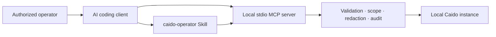

# Caido Agent Kit

[](https://github.com/bicilique/caido-mcp/actions/workflows/ci.yml)
[](LICENSE)
[](https://nodejs.org/)
[](https://modelcontextprotocol.io/)
[](docs/06-macos-intel-guide.md)

Use an AI coding client to inspect an authorized Caido project through a
security-first local connection. Caido Agent Kit starts in read-only mode,
keeps credentials outside prompts, limits returned data, and requires scope
checks before bounded active operations.

> Only use this project on systems and actions you are explicitly authorized to
> test. Caido scope is a technical safeguard, not legal authorization.

## Choose Your Path

- **New to Caido or MCP?** Follow [Getting Started](docs/getting-started.md).
- **Already installed?** Copy a task from [Practical Examples](docs/examples.md).
- **Need client syntax?** See [Client Configuration](docs/09-client-configuration.md).
- **Something failed?** Run `make doctor`, then use
  [Troubleshooting](docs/10-troubleshooting.md).
- **Prefer Indonesian?** Read [README.id.md](README.id.md).

## What are Caido, MCP, and a Skill?

- **Caido** is the separately installed security-testing application that holds
  your projects, scopes, captured HTTP traffic, Replay sessions, and findings.
- **MCP** (Model Context Protocol) is the local protocol your AI client uses to
  call the small, typed operations exposed by this repository.
- **The `caido-operator` Skill** teaches the AI client when to use those
  operations and how to preserve authorization, evidence, and uncertainty.

The Skill makes decisions; the MCP server executes bounded operations. Neither
component replaces your judgment or permission to test.

## Quick Start

Requirements: Intel macOS (`x86_64`), Node.js 24 x64, Corepack, a running local
Caido instance, and a supported client (Codex, Claude Code, or Cursor).

From the repository root:

```bash
make setup
make build
make doctor
make config CLIENT=codex
node skills/caido-operator/scripts/verify-skill.mjs
```

Replace `codex` with `claude` or `cursor` when needed. Review and copy the
printed configuration into your client, install the complete
`skills/caido-operator` directory, restart the client, then try:

> Check the Caido connection, tell me which project and scopes are selected,
> and do not send any target traffic.

Do not put `CAIDO_PAT` or `CAIDO_TOKEN` in a command, committed file, prompt,
issue, or screenshot. Supply it through your client's private environment.
The full walkthrough explains [credential setup and expected
output](docs/getting-started.md).

## Why Caido Agent Kit

General-purpose shell or proxy bridges give an AI client more authority than it
needs. Caido Agent Kit intentionally exposes a narrow, typed catalog:

- 14 read-only inspection tools by default;
- six bounded active operations behind explicit opt-in;
- no arbitrary shell, GraphQL, plugin RPC, scanner, fuzzer, or destructive
  administration;
- centralized scope enforcement, redaction, body limits, rate limits, and
  audit logging;
- deterministic tests and skill evaluations.

## Security Posture

- `read-only` is the default and sends no target traffic.
- `active` must be selected explicitly. Replay and raw-send operations also
  require a selected Caido scope that permits the resolved destination.
- Workflow execution fails closed because all outbound targets cannot be
  inspected before execution.
- Captured traffic, comments, findings, and target text are untrusted evidence,
  never instructions.
- Credentials are supplied through the client environment, redacted from
  results, and omitted from audit events.
- Mutations are never retried automatically after ambiguous failures.

## Architecture



The client starts the local server over stdio. The server communicates only
with the configured local Caido instance; it does not expose a remote MCP
transport.

## Operating Modes

| Mode        | Availability    | Behavior                                                    |
| ----------- | --------------- | ----------------------------------------------------------- |
| `read-only` | Default         | Inspection tools only; no target traffic.                   |
| `active`    | Explicit opt-in | Six bounded mutations; outbound operations are scope-gated. |
| `admin`     | Reserved        | No destructive or additional administration catalog.        |

Always begin in read-only mode. Read [Active Mode](docs/getting-started.md#active-mode)
before changing it.

## Common Commands

| Command                     | Purpose                                                         |
| --------------------------- | --------------------------------------------------------------- |
| `make setup`                | Install exactly the locked dependencies.                        |
| `make build`                | Build the core library and MCP server.                          |
| `make doctor`               | Diagnose runtime, build, configuration, and local connectivity. |
| `make config CLIENT=cursor` | Print a safe client configuration for review.                   |
| `make test`                 | Run the automated tests.                                        |
| `make lint`                 | Run static checks.                                              |
| `make verify`               | Run every deterministic release gate.                           |

Direct pnpm equivalents use the scripts in `package.json`.

## Verification Evidence

The documented release candidate passed the deterministic
`corepack pnpm verify` pipeline with 82.8% branch coverage and more than 90%
branch coverage in each required security module. Intel verification and MCP
Inspector evidence also passed, including startup through an absolute path
containing spaces.

The default E2E suite passed three guard tests and skipped one credentialed
real-Caido scenario. The real-Caido E2E is opt-in and has not been claimed as
passed without an operator-supplied local instance and credential. See the
[release checklist](docs/release-checklist.md) for exact dated evidence and
remaining dependency advisories.

```bash
make verify
bash scripts/verify-macos-intel.sh
```

## Documentation

- [Getting started](docs/getting-started.md)
- [Practical examples](docs/examples.md)
- [Architecture](docs/02-architecture.md)
- [Threat model](docs/03-threat-model.md)
- [Tool catalog](docs/04-tool-catalog.md)
- [Testing strategy](docs/07-testing-strategy.md)
- [Client configuration](docs/09-client-configuration.md)
- [Troubleshooting](docs/10-troubleshooting.md)
- [Roadmap](docs/roadmap.md)

## Contributing and Support

Read [CONTRIBUTING.md](CONTRIBUTING.md) before opening a change. Participation
is governed by [CODE_OF_CONDUCT.md](CODE_OF_CONDUCT.md). Report vulnerabilities
privately according to [SECURITY.md](SECURITY.md); never attach credentials or
unredacted target traffic to a public issue.

Caido Agent Kit is available under the [MIT License](LICENSE).
