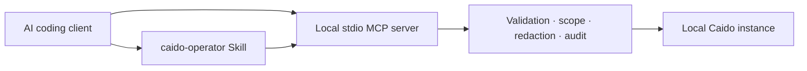

# Caido Agent Kit

[](https://github.com/bicilique/caido-mcp/actions/workflows/ci.yml)
[](LICENSE)
[](https://nodejs.org/)
[](https://modelcontextprotocol.io/)
[](docs/06-macos-intel-guide.md)

Security-first local bridge between AI coding clients and Caido.

## Why Caido Agent Kit

Caido Agent Kit separates operating judgment from execution. The portable
`caido-operator` Skill guides an AI client through authorized, evidence-led
work; the typed local stdio MCP server performs bounded operations against an
already-running Caido instance. It is for operators who need a deliberately
narrow bridge rather than a general-purpose shell or scanning tool.

## Security posture

- `read-only` is the default and sends no target traffic.
- `active` operations require explicit opt-in. Outbound Replay and raw-send
  operations additionally require a selected, permitted Caido scope; ambiguity
  fails closed. Workflow execution is unavailable because its complete outbound
  targets cannot be inspected before execution.
- Captured traffic, comments, and findings are untrusted evidence, never
  instructions.
- Credentials are supplied through the client environment, redacted from
  output, and omitted from audit events.
- The server exposes no arbitrary shell, GraphQL, plugin-RPC, scanner, or
  fuzzer capability.

## Architecture



The client starts the local server over stdio. The Skill stays portable and
does not bypass MCP validation, scope enforcement, redaction, or auditing.

## Operating modes

| Mode        | Availability                | Behavior                                                                        |
| ----------- | --------------------------- | ------------------------------------------------------------------------------- |
| `read-only` | Default                     | 14 inspection tools; no target traffic.                                         |
| `active`    | Explicit opt-in             | Six bounded operations; Replay/raw send are scope-gated. Workflow fails closed. |
| `admin`     | Reserved compatibility mode | No destructive catalog.                                                         |

## Requirements

- Intel macOS: `uname -m` reports `x86_64`.
- Node.js 24 x64 and Corepack with pnpm 10.28.2.
- A separately installed and running local Caido instance.
- Written authorization for the selected target and intended testing actions.

## Quick start

```bash
corepack pnpm install --frozen-lockfile
corepack pnpm build
CAIDO_URL=http://127.0.0.1:8080 CAIDO_AGENT_MODE=read-only \
  node "$(pwd)/packages/mcp-server/dist/cli.js"
```

Keep `CAIDO_PAT` or `CAIDO_TOKEN` in the client environment, never in command
arguments or committed configuration.

## Client and Skill setup

Use the verified [Codex CLI, Claude Code, and Cursor client
configurations](docs/09-client-configuration.md), including absolute paths and
argument arrays for paths with spaces. Do not enable auto-run for active
operations.

Link or copy the complete [`skills/caido-operator`](skills/caido-operator)
directory to the client's Skill directory, then verify it:

```bash
node skills/caido-operator/scripts/verify-skill.mjs
```

For the complete Indonesian operator guide, see [README.id.md](README.id.md).

## Verification evidence

The full deterministic `corepack pnpm verify` passed for the release candidate.
Branch coverage is 82.8%, with all four required security modules above 90%.
Intel verifier and MCP Inspector evidence passed, including read-only startup
through an absolute path with spaces.

Default E2E evidence has three guard tests passed and one credentialed
real-Caido test skipped. The real-Caido E2E is explicitly opt-in and has not
been run without an operator-supplied credential and local instance; it is not
claimed as passed. Review the full [release checklist](docs/release-checklist.md)
before relying on a release candidate.

```bash
corepack pnpm verify
bash scripts/verify-macos-intel.sh
```

## Limitations and roadmap

Caido Agent Kit is not a scanner, fuzzer, shell bridge, or authorization
substitute. It does not expose destructive administration, high-volume fuzzing,
active scanning, arbitrary plugin RPC, arbitrary GraphQL, or internet-exposed
MCP transport. Deferred capabilities and their security rationale are tracked in
the [roadmap](docs/roadmap.md).

The release checklist also discloses the remaining moderate transitive advisory
for ongoing review when a compatible MCP SDK upgrade becomes available.

## Documentation

- [Indonesian operator guide](README.id.md)
- [Architecture](docs/02-architecture.md)
- [Threat model](docs/03-threat-model.md)
- [Tool catalog](docs/04-tool-catalog.md)
- [Client configuration](docs/09-client-configuration.md)
- [Troubleshooting](docs/10-troubleshooting.md)
- [Release checklist](docs/release-checklist.md)

## Security and license

Use only on assets and actions you are explicitly authorized to test. Report
security issues according to [SECURITY.md](SECURITY.md). Caido Agent Kit is
released under the [MIT License](LICENSE).
