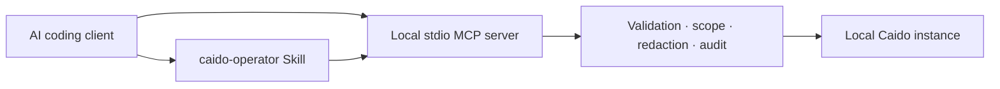

# Security-First README and Git Ignore Implementation Plan

> **For agentic workers:** REQUIRED SUB-SKILL: Use superpowers:subagent-driven-development (recommended) or superpowers:executing-plans to implement this plan task-by-task. Steps use checkbox (`- [ ]`) syntax for tracking.

**Goal:** Publish a professional security-first repository landing page and a narrowly scoped `.gitignore`, then push the completed branch and open a Pull Request.

**Architecture:** Keep the English root README as the concise public landing page and route operational detail to the existing Indonesian guide and numbered documentation. Validate presentation and ignore-policy behavior through the existing documentation test project, then run the complete release gate before delivery.

**Tech Stack:** Markdown, Mermaid, Vitest, Node.js 24 x64, pnpm 10.28.2, Git, GitHub CLI.

## Global Constraints

- Repository URL is `https://github.com/bicilique/caido-mcp.git`.
- Pull Request base is `feat/caido-agent-kit`.
- Do not claim that credentialed real-Caido E2E passed.
- Badge and evidence claims must match `docs/release-checklist.md`.
- Do not ignore source, tests, documentation, workflows, lockfiles, generated tool documentation, examples, or release evidence.
- Preserve a side-effect-free default read-only posture and existing security terminology.

---

### Task 1: Security-First Landing Page and Ignore Policy

**Files:**
- Modify: `README.md`
- Modify: `.gitignore`
- Modify: `tests/docs/documentation.test.ts`

**Interfaces:**
- Consumes: verified release evidence from `docs/release-checklist.md`.
- Produces: a professional root landing page and test-enforced local-artifact ignore policy.

- [ ] **Step 1: Add failing presentation and ignore-policy contracts**

Add a documentation test that reads `README.md` and requires the exact public
sections and repository-specific badge target:

```ts
const readme = await readFile(join(root, "README.md"), "utf8");

expect(readme).toContain(
  "https://github.com/bicilique/caido-mcp/actions/workflows/ci.yml",
);
expect(readme).toMatch(/## Security posture/i);
expect(readme).toMatch(/## Architecture/i);
expect(readme).toContain("```mermaid");
expect(readme).toMatch(/## Operating modes/i);
expect(readme).toMatch(/## Quick start/i);
expect(readme).toMatch(/## Verification evidence/i);
expect(readme).toMatch(/real-Caido E2E/i);
expect(readme).toContain("README.id.md");
```

Add a contract for the ignore rules and ensure protected repository files are
not ignored:

```ts
const gitignore = await readFile(join(root, ".gitignore"), "utf8");

for (const rule of [
  ".env*",
  "!.env.example",
  ".idea/",
  ".vscode/",
  ".pnpm-store/",
  "*.tsbuildinfo",
  ".caido-agent/",
  "*.swp",
  "*~",
]) {
  expect(gitignore).toContain(rule);
}

for (const trackedPath of [
  "README.md",
  "README.id.md",
  "packages/core/src/config.ts",
  "tests/docs/documentation.test.ts",
  "docs/02-architecture.md",
  ".env.example",
  "docs/release-checklist.md",
  "pnpm-lock.yaml",
  ".github/workflows/ci.yml",
  "skills/caido-operator/references/tool-selection.md",
]) {
  const result = spawnSync(
    "git",
    ["check-ignore", "--no-index", "-q", trackedPath],
    {
      cwd: root,
    },
  );
  expect(result.status).toBe(1);
}
```

- [ ] **Step 2: Run the documentation test and confirm RED**

Run:

```bash
corepack pnpm test:docs
```

Expected: failure because the new README sections and ignore rules are absent.

- [ ] **Step 3: Rewrite the English README**

Use this exact section order:

```markdown
# Caido Agent Kit

[CI, MIT, Node 24, MCP, macOS Intel badges]

Security-first local bridge between AI coding clients and Caido.

## Why Caido Agent Kit
## Security posture
## Architecture
## Operating modes
## Requirements
## Quick start
## Client and Skill setup
## Verification evidence
## Limitations and roadmap
## Documentation
## Security and license
```

The architecture block must show:



The mode table must state:

- `read-only`: default; 14 inspection tools; no target traffic.
- `active`: explicit opt-in; seven scope-gated atomic operations.
- `admin`: reserved compatibility mode; no destructive catalog.

The verification section must preserve these evidence boundaries:

- full deterministic `pnpm verify` passed;
- branch coverage is 82.8%, with all four required security modules above 90%;
- Intel verifier and Inspector evidence passed;
- default E2E has three guard tests passed and one credentialed real-Caido test
  skipped.

- [ ] **Step 4: Tighten `.gitignore` without hiding project evidence**

Organize rules under short comments:

```gitignore
# Dependencies and generated output
node_modules/
.pnpm-store/
dist/
coverage/
*.tsbuildinfo

# Environment and local credentials
.env*
!.env.example
.caido-agent/

# Local tools and IDEs
.worktrees/
.serena/
.idea/
.vscode/

# Operating-system and editor files
.DS_Store
*.log
*.swp
*.swo
*~
tmp/
temp/
```

Do not add broad patterns such as `*.json`, `*.jsonl`, `docs/`, `tests/`,
`assets/`, or `.github/`.

- [ ] **Step 5: Format and run GREEN**

Run:

```bash
corepack pnpm exec prettier --write README.md tests/docs/documentation.test.ts
corepack pnpm test:docs
corepack pnpm scan:secrets
git diff --check
```

Prettier formats only the supported Markdown and TypeScript files; it does not
format the extensionless `.gitignore`. The documentation test separately
validates every required ignore rule and runs `git check-ignore --no-index`
against representative source, test, documentation, example, release-evidence,
workflow, lockfile, and generated-documentation paths.

Expected: formatting, documentation tests, and secret scan pass; no whitespace
errors.

- [ ] **Step 6: Commit the landing-page change**

```bash
git add README.md .gitignore tests/docs/documentation.test.ts
git commit -m "docs: polish security-first repository landing page"
```

---

### Task 2: Final Verification and Pull Request Delivery

**Files:**
- No project file changes expected.

**Interfaces:**
- Consumes: clean `feat/caido-agent-kit-completion` at the Task 1 commit.
- Produces: pushed branch and Pull Request targeting `feat/caido-agent-kit`.

- [ ] **Step 1: Run the complete release gate**

```bash
source /Users/balaisertifikasielektronik/.nvm/nvm.sh
nvm use 24
corepack pnpm verify
bash scripts/verify-macos-intel.sh
corepack pnpm test:e2e
git diff --check
git status --short
```

Expected: all deterministic gates pass; default E2E reports three passed and
one credentialed test skipped; Git status is clean.

- [ ] **Step 2: Configure the provided remote**

```bash
git remote add origin https://github.com/bicilique/caido-mcp.git
git remote -v
```

If `origin` already exists, verify it exactly matches the provided URL before
using `git remote set-url origin`.

- [ ] **Step 3: Push the feature branch**

```bash
git push -u origin feat/caido-agent-kit-completion
```

- [ ] **Step 4: Open the Pull Request**

```bash
gh pr create \
  --repo bicilique/caido-mcp \
  --base feat/caido-agent-kit \
  --head feat/caido-agent-kit-completion \
  --title "feat: complete security-first Caido Agent Kit" \
  --body-file /tmp/caido-agent-kit-pr.md
```

The PR body must summarize the runtime, security pipeline, active scope gates,
Skill evaluation, Intel/CI/release work, README polish, verification counts,
the one moderate transitive advisory, and the credentialed real-Caido E2E
remaining command.

- [ ] **Step 5: Confirm delivery**

```bash
gh pr view \
  --repo bicilique/caido-mcp \
  --json url,baseRefName,headRefName,state,title
```

Expected: an open PR from `feat/caido-agent-kit-completion` to
`feat/caido-agent-kit`. Preserve the worktree for review feedback.
